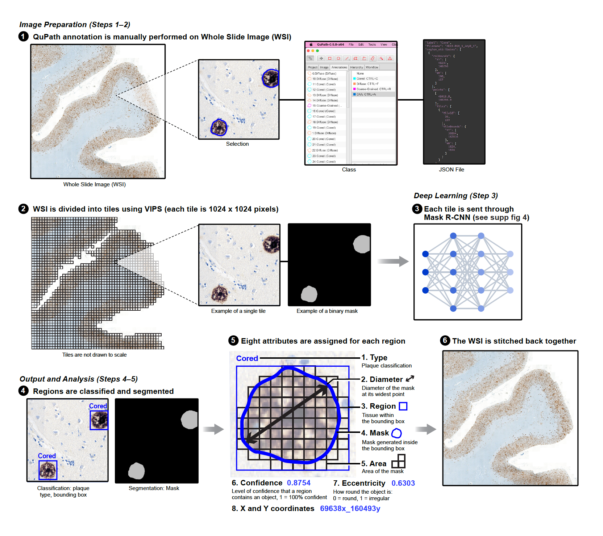

## Generalizable Prediction of Alzheimer’s Disease Pathologies with Human-Level Accuracy

[[`Model`](https://huggingface.co/vivekgr92/amyb-detection)] [[`MedRxiv`](https://www.medrxiv.org/content/10.1101/2025.02.03.25321603v1.full.pdf)] [[`BibTeX`](#Citation)]

---

## Detection results in Qupath


## Model Overview


## Quick Start: Use with QuPath (No Coding Needed!)
You can run the AmyB-plaque detection model directly inside QuPath using a script. This allows you to analyze your slides and see results visually — no deep learning or Python required!

✅ What You Need
QuPath v0.5.0+

The script from src/inference/visualize_model_predictions_in_Qupath/WSI_inference.groovy 

A RunPod API key (for running the model in the cloud)

Part 1:
[RunPod Setup Video](https://www.loom.com/share/2e3a9e8772d94106963f52be0642bbe7?sid=8f2f2027-ed8a-41bf-bd9f-17fa1facaf0b)

Part 2:
[QuPath Visualization Setup with RunPod](https://www.loom.com/share/87813941fc0b49b988f7a3cda43eb3db?sid=a4ed6497-4ec9-4672-b9f0-ad155b0d75f2)

### Step 1: Sign Up

Sign up for RunPod to get started and access powerful GPUs:  
👉 [Sign up for RunPod](https://runpod.io?ref=1mh0obxo)

### Step 2: Add Credits

After signing up, add credits to your RunPod account. This will allow you to use the GPU resources for running inference tasks.

### Step 3: Get Your API Key

1. Navigate to the **Settings** section in your RunPod account.
2. Click on **API KEY**.
3. Create a new API key and save it securely for use in your scripts.

### Step 4: Configure Serverless Template

1. Go to the **Templates** section in your RunPod dashboard.
2. Create a new **Serverless Template**.
3. In the template configuration, use the following image:  
   `vivekgr92/wsi-inference:latest`
   
### Step 5: Create a New Endpoint

1. Go to the **Serverless** section in your RunPod dashboard.
2. Create a **New Endpoint**.
3. Select the template you created earlier.
4. Hit **OK** and wait for a few minutes for the endpoint to be created.

### Step 6: Get Your Endpoint URL

Once the endpoint is created and running, go to the **Overview** tab in your RunPod dashboard to retrieve your **Endpoint URL**.


### Step 7: Configure the Script

Update the following values in your script:
```src/inference/visualize_model_predictions_in_Qupath/WSI_inference.groovy ```

```groovy
// *** Change both url_endpoint and apiUrl *****

def url_endpoint = "YOUR_ENDPOINT_ID"
def apiUrl = "https://api.runpod.ai/v2/YOUR_ENDPOINT_ID/run"

def apiKey = "YOUR_RUNPOD_API_KEY"
def csv_path = "path/to/your/output.csv"
```

This setup will call your model hosted on RunPod and save detection results to a CSV.


## 🛠️ Customize & Fine-Tune the Model

If you'd like to modify the codebase, add custom logic, or fine-tune the model on your own data use the below instructions


## 🚀 Quick Start: Docker Installation

To speed up setup and avoid dependency issues, we provide a pre-built Docker image on Docker Hub.

### Step 1: Download Docker Image

Make sure you have Docker installed. Then pull the image:

```bash
docker pull monikaahirwar/amy_plaque:latest
```

### Step 2: Run the Docker Container

```bash
docker run -it -e PYTHONPATH=/app/src --rm amy_plaque:latest
```

> Replace `/path/to/your/data` with the actual path to your image and annotation files. This will mount your local data directory into the container.

---

## 🔧 Software Dependencies (If Not Using Docker)

- QuPath v0.5.0
- Java 17+
- Python 3.10+
- PyTorch + Lightning
- OpenCV
- Pandas, NumPy, Matplotlib, Seaborn

---

## 📁 Workflow Instructions

### 1. QuPath Project Setup

Each Whole Slide Image (WSI) should be opened as a QuPath project.  
For example, for a WSI named `XE10-045_1_AmyB_1.mrxs`, create a project named `XE10-045_1_AmyB_1`.

Projects are typically saved under:  
`/home/user/Qupath/bin/`

---

### 2. Annotating WSIs in QuPath

Install and use the annotation tool from:

```bash
./src/annotationTool
```

---

### 3. Convert QuPath Annotations to JSON

Run the script below to convert QuPath annotations into a custom JSON format for training:

```bash
./src/qupath_scripts/export_annotation_training_scripts
```

---

### 4. Generate Crops and Masks for Training

1. Run this Python script to extract crops and binary masks:

```bash
python ./src/data/training_data/generate_data_from_annotations.py
```

2. Use the following notebook to split and augment data:

```bash
./src/data/training_data/Data_split_and_augmentation.ipynb
```

3. Compute mean and standard deviation for normalization:

```bash
./src/data/training_data/compute_mean_std_amyb.ipynb
```

---

### 5. Train the Mask R-CNN Model

Use PyTorch Lightning to train the model from:

```bash
./src/models
```

The model learns to detect both object instances and segmentation masks of plaques.

---

### 6. Run Inference on New Slides

**Internal Dataset:**

```bash
./src/inference/internal_dataset
```

**External Dataset:**

```bash
./src/inference/external_dataset
```

Steps include background subtraction, crop extraction, and plaque detection.

---

### 7. Clinical Correlation Analysis

Combine plaque-level features (e.g. count, size, area) with clinical metadata to study correlations:

```bash
./src/clinical_correlation_analysis
```

---

### 8. Interrater Study

- Prepare annotation JSONs:

```bash
./src/qupath_scripts/interrater_study_scripts
```

- Compute pairwise agreement (Cohen's kappa):

```bash
./src/interrater_study/pairwise_kappa_NPs.ipynb
```

- Compare model performance with human consensus:

```bash
./src/interrater_study/Performance_metric_NPs_consensus.ipynb
```

---

## Citation
If you find this paper useful for your your research and applications, please cite using this BibTeX:

```bibtex
@article {Gopal Ramaswamy2025.02.03.25321603,
	author = {Gopal Ramaswamy, Vivek and Ahirwar, Monika and Ryan, Gennadi and Dugger, Brittany N. and Al Dalahmah, Osama and Signaevsky, Maxim and Purohit, Dushyant P. and Haroutunian, Vahram and Finkbeiner, Steven},
	title = {Generalizable Prediction of Alzheimer Disease Pathologies with a Scalable Annotation Tool and an High-Accuracy Model},
	elocation-id = {2025.02.03.25321603},
	year = {2025},
	doi = {10.1101/2025.02.03.25321603},
	URL = {https://www.medrxiv.org/content/early/2025/02/05/2025.02.03.25321603},
	eprint = {https://www.medrxiv.org/content/early/2025/02/05/2025.02.03.25321603.full.pdf},
	journal = {medRxiv}
}
```